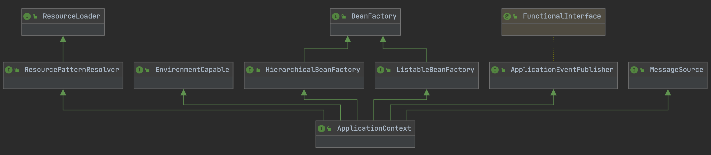
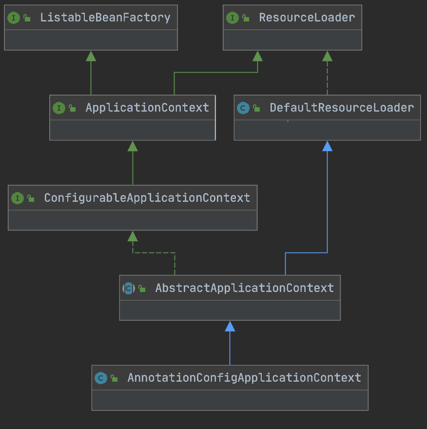
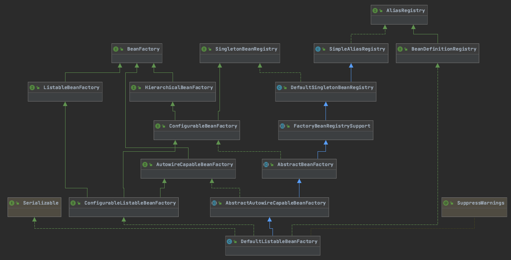

# Bean의 등록 과정
ApplicationContext 부터 천천히 따라가며 Bean이 어떤 과정을 통해 등록 되는 지 알아보자.

## ApplicationContext


BeanFactory를 상속 받은 HierarchicalBeanFatory, ListaableBeanFactory를 상속 받고 있고, 또한 다른 여러 인터페이스도 상속받고 있다. 

ApplicationContext는 Bean을 등록하고 가져오는데 쓰이는 것으로만 생각하고 있었으나, 소스를 열어보니 그렇지 않았다.

실제로 ApplicationContext의 설명을 보면

> Application의 Component에 접근할 수 있는 BeanFactory 메서드 제공\
> &nbsp;&nbsp;&nbsp;&nbsp;- ListableBeanFactory 인터페이스\
> 포괄적인 방식(Generic Fashion)으로 file resource를 읽을 수 있다.\
> &nbsp;&nbsp;&nbsp;&nbsp;- ResourceLoader 인터페이스\
> 등록 되어 있는 Listener에 event를 publish 할 수 있음\
> &nbsp;&nbsp;&nbsp;&nbsp;- ApplicationEventPublisher\
> message를 resolving 할 수 있음. internationalization 지원\
> &nbsp;&nbsp;&nbsp;&nbsp;- MessageSource 인터페이스

이렇게 되어 있다. Spring 프레임워크가 지원하는 기능들이 모여 있는 것을 알 수 있다. 지금은 BeanFactory에 관해 알아보고 있으니 **ApplicationContext가 BeanFactory의 기능을 어떤 방식으로 제공하는 지** 중심으로 알아보자.

ApplicationContext의 구현체를 포함한 클래스다이어그램을 살펴보면(여러 구현체 중 AnnotationConfigApplicationContext만 가져와 보았다.) 앞선 클래스 다이어그램에서 **ConfigurableApplicationContext**, **AbstractApplicationContext**, **AnnotationConfigApplicationContext** 등등 여러 인터페이스와 클래스가 추가 되어 있는 것을 확인할 수 있다.



## Bean의 등록은 어디에서?
처음엔 ApplicationContext가 BeanFactory를 상속받고 있으므로 ApplicationContext의 구현체에서 직접 Bean을 등록할 것으로 생각했으나, 소스를 살펴본 결과 그렇지 않았다.

**AnnotationConfigApplicationContext**을 살펴보면, 

```java
public class AnnotationConfigApplicationContext extends GenericApplicationContext implements AnnotationConfigRegistry {

	private final AnnotatedBeanDefinitionReader reader;

	private final ClassPathBeanDefinitionScanner scanner;

    ...

    //---------------------------------------------------------------------
    // Implementation of AnnotationConfigRegistry
    //---------------------------------------------------------------------
    @Override
    public void register(Class<?>... componentClasses) {
        Assert.notEmpty(componentClasses, "At least one component class must be specified");
        this.reader.register(componentClasses);
    }

    @Override
    public void scan(String... basePackages) {
        Assert.notEmpty(basePackages, "At least one base package must be specified");
        this.scanner.scan(basePackages);
    }

}
```

**AnnotatedBeanDefinitionReader**, **ClassPathBeanDefinitionScanner**가 필드로 선언되어 있는데, 각 클래스는 `register(Class...)` 메서드와 `scan(String...)` 에서 쓰인다.

저 외에 다른 부분을 살펴보아도 **AnnotationConfigApplicationContext**에서 직접 Bean을 등록하는 부분은 안보인다. `class 배열`을 받아 **AnnotatedBeanDefinitionReader** 를 이용해 등록하거나 `package 경로`를 받아 **ClassPathBeanDefinitionScanner** 를 이용해 경로를 scan 하여 bean을 등록하는 것으로 보인다. 혹시나 조상 클래스에서 구현된 로직이 있나 살펴봤지만

### GenericApplicationContext 에선 

```java
public class GenericApplicationContext extends AbstractApplicationContext implements BeanDefinitionRegistry {
    
    private final DefaultListableBeanFactory beanFactory;

    public GenericApplicationContext() {
        this.beanFactory = new DefaultListableBeanFactory();
    }

    //---------------------------------------------------------------------
    // Implementation of BeanDefinitionRegistry
    //---------------------------------------------------------------------
    @Override
    public void registerBeanDefinition(String beanName, BeanDefinition beanDefinition)
            throws BeanDefinitionStoreException {

        this.beanFactory.registerBeanDefinition(beanName, beanDefinition);
    }
    ...
}
```

`registerBeanDefinition`에서 **DefaultListableBeanFactory**의 `registerBeanDefinition` 메서드를 호출하며 bean 등록하는 역할(?)을 **DefaultListableBeanFactory에 위임(?)** 하고 있었고,

### AbstractApplicationContext 에서는 
bean을 등록하는 부분이 보이지 않았다. 

> BeanFactory 에서 bean을 등록하는 줄 알았는데 소스를 보면 그게 아닌것 같다. **GenericApplicationContext** 를 보면 **BeanDefinitionRegistry**를 구현하고 있는데, 여기서 제공하는 `registerBeanDefinition`메서드가 bean의 등록을 책임지는것 같다.

자... 그럼 이제 **DefaultListableBeanFactory**에 대해 알아보자

### DefaultListableBeanFactory


지금 까지 알아본 바로, ApplicationContext의 구현체는 BeanDefinitionRegistry 인터페이스를 구현하며, 내부적으로 DefaultListableBeanFactory 클래스에 Bean 등록의 책임을 위임하고 있다.

**DefaultListableBeanFactory**를 살펴봤는데, **BeanDefinitionRegistry** 등 여러 인터페이스를 구현하고 있었으며, Bean을 등록하는 데 필요한 모든 기능을 갖춘 유일한 클래스 인것 같다(BeanFactory의 다른 구현체가 있긴 함). 

그 중 Bean을등록할 때 사용 되는(BeanDefinitionRegistry의 메서드) `registerBeanDefinition` 메서드를 살펴보자.
```java
public class DefaultListableBeanFactory extends AbstractAutowireCapableBeanFactory
		implements ConfigurableListableBeanFactory, BeanDefinitionRegistry, Serializable {
    
    ...

    public void registerBeanDefinition(String beanName, BeanDefinition beanDefinition)
            throws BeanDefinitionStoreException {

        ...

        BeanDefinition existingDefinition = this.beanDefinitionMap.get(beanName);
        if (existingDefinition != null) {
            ...
            ////////////////////////////////////////////////////
            //                     이 부분                      //
            ////////////////////////////////////////////////////
            this.beanDefinitionMap.put(beanName, beanDefinition);
        }
        else {
            ...
        }

        ...
    }
    ...
}
```

드디어 찾았다. bean의 등록은 **DefaultListableBeanFactory** 클래스의 `registerBeanDefinition` 메서드 에서 이루어지고 있었다.

## 정리
지금 까지 알아본 것을 정리하면 
* **Bean을 등록하는 책임**은 사실 BeanFactory가 아닌 **BeanDefinitionRegistry**가 가지고 있다.
* ApplicationContext 인터페이스는 BeanFactory 인터페이스와 BeanDefinitionRegistry 인터페이스를 상속받고 있다.
* **ApplicationContext 구현체**(**GenericApplicationContext**)의 `registerBeanDefinition` 메서드를 통해 Bean의 등록이 진행되지만
* ApplicationContext 의 구현체는 기능을 직접 구현하진 않고
* BeanFactory 와 BeanDefinitionRegistry를 구현한 구현체(**DefaultListableBeanFactory**)에 그 책임을 위임하고 있다.
* **DefaultListableBeanFactory**는 `registerBeanDefinition` 메서드를 통해 Bean을 **beanDefinitionMap에 저장**한다.