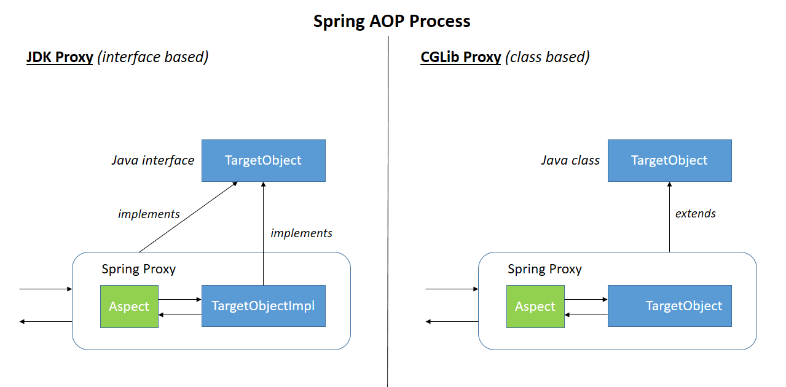

# AOP
Aspect-oriendted Programming (AOP)은 OOP를 보완하는 수단으로, 흩어진 Aspect를 모듈화 할 수 있는 프로그래밍 기법. 흩어진 관심사 (Crosscutting Concerns)

## AOP 용어
용어|설명
-|-
Aspect|공통적으로 적용될 기능을 의미. 횡단 관심사의 기능이라고도 할 수 잇으며 한 개 이상이 Pointcut과 Advice 조합으로 만들어진다.
Advice|관점의 구현체로 조인포인트에 삽입되어 동작하는것을 의미함. 스프링에서 사용하는 Advice는 동작하는 시점에따라 다섯 종류로 구분된다.
Jointpoint|어드바이스를 적용하는 지점을 의미. 스프링에서 Jointpoint는 항상 메서드 실행단계만 가능하다.
Pointcut|Advice를 적용할 조인트포인트를 선별하는 과정이나 그 기능을 정의한 모듈을 의미. 정규표현식이나 AspectJ문법을 이용하여 어떤 Jointpoint를 사용할지 결정.
Target|Advice를 받을 대상을 의미
Weaving|어드바이스를 적용하는것을 의미. 공통 코드를 원하는 대상에 삽입하는것을 의미한다.

## Weaving
종류|설명
-|-
Runtime weaving|JDK dynamic proxy 나 CGLIB proxy를 생성하여 실행시간에 target에 weaving 하는 방식
Compile-time weaving|컴파일 시점에 Application 소스코드와 Aspect 코드를 Weaving 하여 AOP가 적용된 클래스를 만들어내는 방식
Post-compile weaving|Binary weaving이라고도 하며 이미 존재하는 클래스나 JAR파일을 조작하여 weaving 한다.
Load-time weaving|Weaving 하는 시점을 class loader가 class를 jvm에 로드하는 시점으로 늦춘 것 빼고 Post-compile weaving방식과 동일. 

### Runtime weaving
Spring AOP가 사용하는 방식으로, proxy(JDK dynamic proxy 나 CGLIB prox)를 사용하여 구현되었다.

둘의 차이점은, JDK dynamic proxy는 interface 기반, CGLIB proxy는 class 기반이라는 것이다.

## AOP 구현체
* AspectJ
* 스프링 AOP
### 스프링 AOP: 프록시 기반 AOP
스프링 AOP 특징
* 프록시 기반의 AOP 구현체
* 스프링 빈에만 AOP를 적용 할 수 있다.
* 모든 AOP 기능을 제공하는 것이 목적이 아니라, 스프링 IoC와 연동하여 엔터프라이즈 애플리케이션에서 가장 흔한 문제에 대한 해결책을 제공하는 것이 목적
* 스프링 IoC 컨테이너가 제공하는 기반 시설과 Dynamic 프록시를 사용하여 여러
복잡한 문제 해결.
* 동적 프록시: 동적으로 프록시 객체 생성하는 방법
* 자바가 제공하는 방법은 인터페이스 기반 프록시 생성.
* CGlib은 클래스 기반 프록시도 지원.
* 스프링 IoC: 기존 빈을 대체하는 동적 프록시 빈을 만들어 등록 시켜준다.
* 클라이언트 코드 변경 없음.
* AbstractAutoProxyCreator implements BeanPostProcessor

### AspectJ